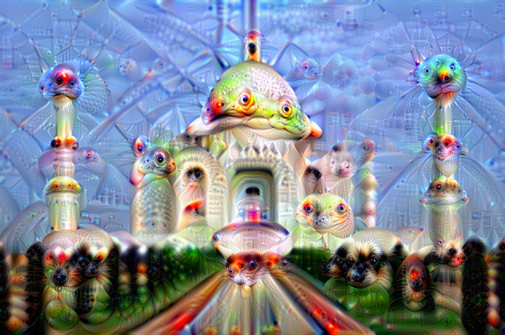
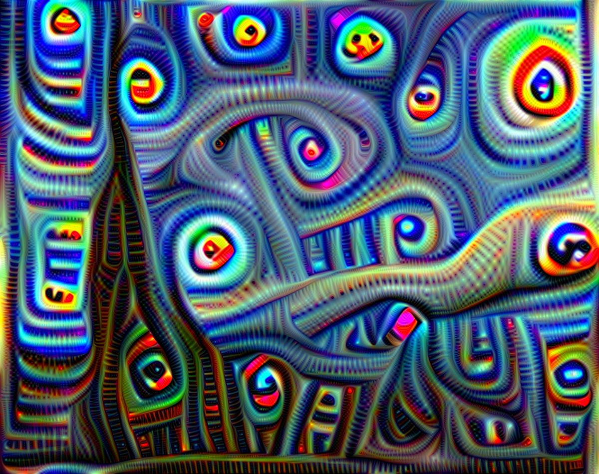
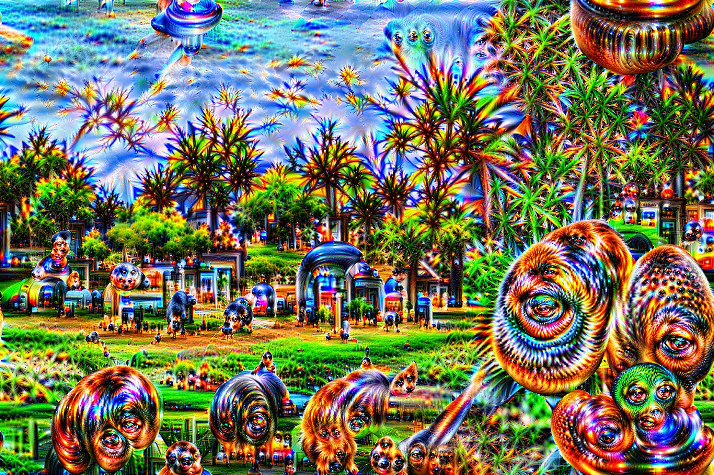
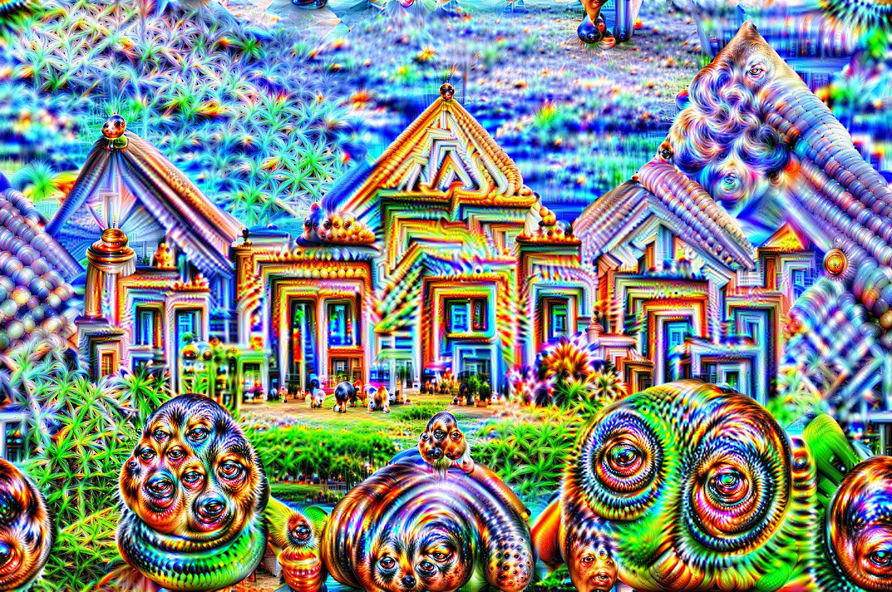

# DeepDream Implementation in PyTorch

This repository contains an implementation of the DeepDream algorithm using PyTorch. DeepDream is a computer vision technique that generates trippy, dream-like images by enhancing patterns found in images using a convolutional neural network.

Here are some examples generated from this implementation:

